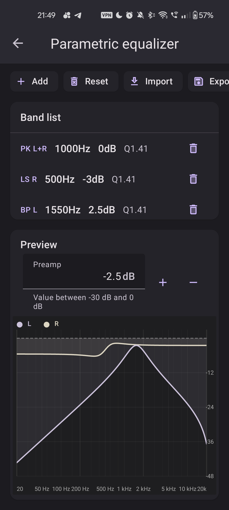
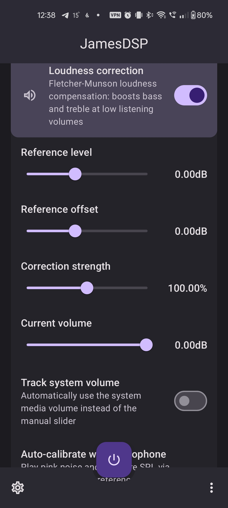
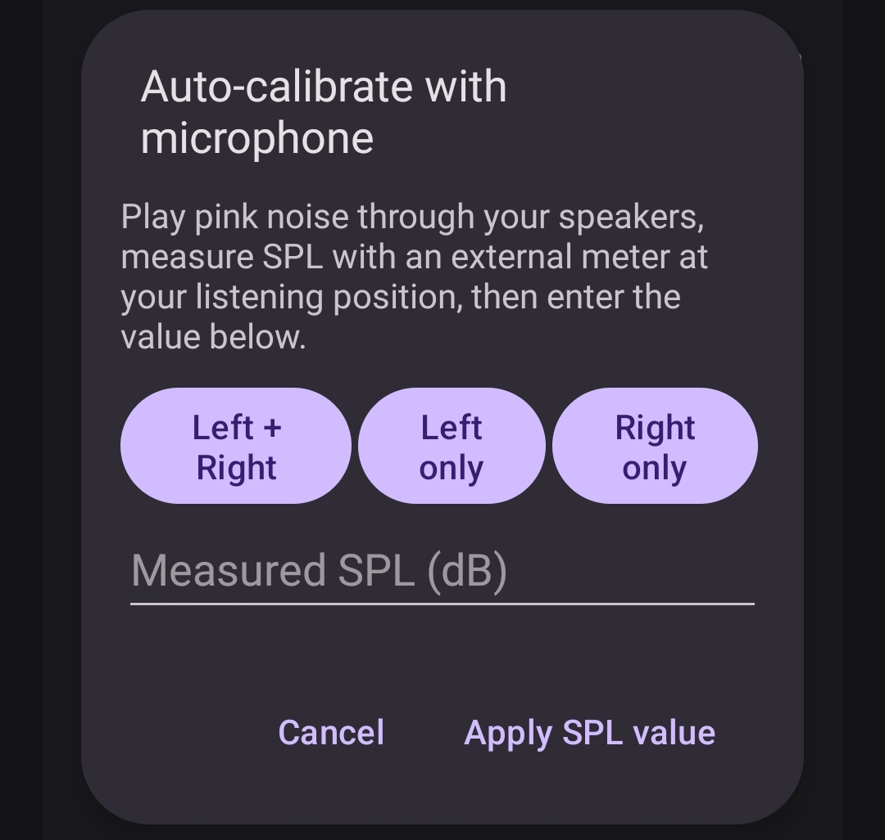
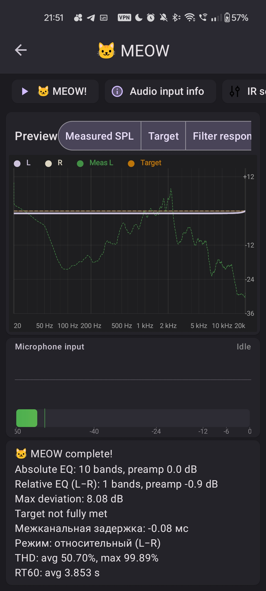
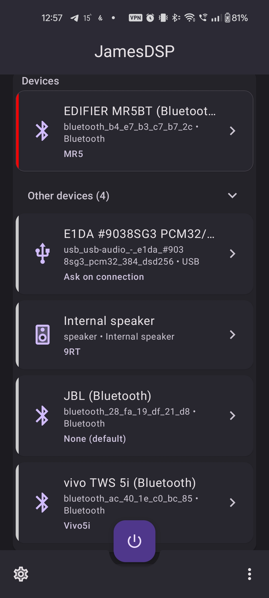
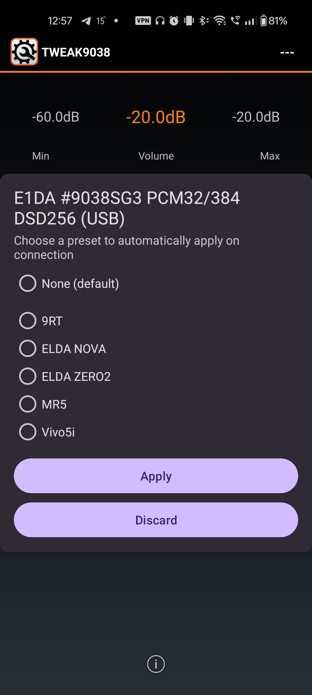

<h1 align="center">
  
  <br>
  Loundess-PEQ-RootlessJamesDSP
  <br>
</h1>

<h4 align="center">System-wide JamesDSP with PEQ biquad cascade, loudness correction, and acoustic measurement — for non-rooted and rooted Android</h4>

<p align="center">
  <a href="https://github.com/evoeram/Loundess-PEQ-RootlessJamesDSP/releases">
    
  </a>
  <a href="https://github.com/evoeram/Loundess-PEQ-RootlessJamesDSP/releases">
    
  </a>
  <a href="https://github.com/evoeram/Loundess-PEQ-RootlessJamesDSP/blob/master/LICENSE">
    
  </a>
  <a href="https://github.com/evoeram/Loundess-PEQ-RootlessJamesDSP/actions/workflows/build.yml">
    
  </a>
</p>

<p align="center">
  <a href="#key-features">Features</a> •
  <a href="#processing-modes">Processing Modes</a> •
  <a href="#auto-eq--measurement-wizard-meow">Auto-EQ</a> •
  <a href="#downloads">Downloads</a> •
  <a href="#differences-from-upstream">vs Upstream</a> •
  <a href="#building">Building</a> •
  <a href="#credits">Credits</a>
</p>

<p align="center">
  
  
  
  
  
  
</p>
<p align="center"><sub>Parametric EQ · Loudness Correction · Manual SPL Calibration · MEOW Wizard · Device Preset Selector · Ask on Connection</sub></p>

---

## Overview

**Loundess-PEQ-RootlessJamesDSP** is an enhanced fork of [RootlessJamesDSP](https://github.com/timschneeb/RootlessJamesDSP) by Tim Schneeberger. It adds three major subsystems on top of the original system-wide audio processing app:

1. **Time-domain PEQ biquad cascade** — real RBJ biquad filters (ported from EqualizerAPO) replacing the FFT-magnitude approximation, with per-band stereo channel routing and up to 64 bands
2. **Loudness correction** — Fletcher–Munson compensation (ported from EqualizerAPO) with auto-calibration via microphone SPL measurement
3. **Acoustic measurement & Auto-EQ wizard (MEOW)** — Farina log-sweep measurement, deconvolution to impulse response, SPL extraction, and greedy iterative PEQ filter fitting against a target curve

The app works on **non-rooted devices** (via MediaProjection audio capture) and **rooted devices** (via Magisk/KernelSU/SukiSU/APatch module with direct AudioFlinger integration).

### Requirements

| | Minimum | Recommended |
|---|---|---|
| Android version | 10 (API 29) | 12+ |
| For Movie Mode | 9 (API 28, DynamicsProcessing) | 12+ |
| For root mode | Magisk / KernelSU / SukiSU / APatch | — |

---

## Key Features

### 🔧 Parametric EQ (Time-Domain Biquad Cascade)

Unlike the upstream GraphicEQ-based PEQ path (which approximates filter responses via FFT magnitude), this fork implements a true **time-domain biquad cascade** ported from [EqualizerAPO](https://sourceforge.net/projects/equalizerapo/):

- All **8 RBJ biquad filter types**: Peaking, Low-shelf, High-shelf, Low-pass, High-pass, Band-pass, Notch, All-pass
- **Preamp** gain stage (9th filter type — flat frequency-independent gain)
- **Per-band channel routing**: L+R (both), L only, R only — allows different EQ curves per stereo channel
- Up to **64 bands** (upstream max: 32) with variable-size parameter buffer
- Per-band enable/disable
- Real-time frequency response preview (`ParametricEqSurface`)

### 🔊 Loudness Correction (Fletcher–Munson Compensation)

At low listening volume, the human ear is less sensitive to bass and treble. This filter measures the difference between current playback volume and a user-defined reference level, then applies scaling low-shelf (75 Hz) and high-shelf (10 kHz) boosts:

- Ported from EqualizerAPO's `LoudnessCorrectionFilter` (© Alexander Walch, GPLv2)
- Lock-free coefficient recomputation on audio thread (`std::atomic<double>`)
- Volume pushed from Kotlin layer (reads Android media stream volume)
- Configurable reference level, reference offset, and attenuation strength

**Auto-calibration** (`LoudnessCalibrationManager`):
- **Microphone mode** — plays pink noise, records via microphone, computes RMS → dBFS
- **Manual SPL mode** — user measures SPL with an external SPL meter and enters the value
- Noise channel selection: Left / Right / Both
- Continuous pink noise generation (no looping artifacts)

### 🎯 Auto-EQ & Measurement Wizard (MEOW)

> MEOW — **M**easurement, **E**qualization & **O**ptimization **W**izard

A complete acoustic measurement pipeline for speaker/headphone equalization:

1. **Sweep generation** — logarithmic sine sweep (Farina method), exponential frequency growth from f₁ to f₂
2. **Playback & recording** — sweep played through `AudioTrack`, response recorded via `AudioRecord` or native measurement engine
3. **Deconvolution** (Farina method) — FFT-based: recorded signal × inverse filter → impulse response, with THD trimming via Tukey window
4. **SPL extraction** — windowed FFT of IR → magnitude in dB, with fractional-octave smoothing (1/1 to 1/48, or variable)
5. **Auto-EQ fitting** (`AutoEqEngine`) — greedy iterative algorithm:
   - Finds frequency with maximum deviation from target curve
   - Places a peaking filter with gain = −E(f₀), Q computed from −3 dB bandwidth
   - Q limits: ≤15 for low freqs (<200 Hz), ≤5 for high freqs (>200 Hz)
   - Non-minimum-phase awareness: narrow deep notches (cancellation) are **not** corrected; only broad dips
   - Iterates until flatness target or max band count is reached
6. **Target curve editor** — custom target curves with visual editing (`TargetCurveEditorFragment`)

Native C implementation for performance-critical DSP: `sweep_generator.c`, `farina_deconv.c`, `spl_response.c`, `ir_windowing.c`, `measurement_jni.c`.

---

## Processing Modes

The app supports three processing modes to balance DSP capability, latency, and stability:

| Mode | Technology | Latency | Active DSP | Use Case |
|---|---|---|---|---|
| **Movie Mode** | `DynamicsProcessing` API (no capture loop) | ~10–40 ms | GraphicEQ + PEQ only | YouTube, Netflix, TikTok (A/V sync critical) |
| **Standard Mode** | Legacy MediaProjection capture loop | ~150–170 ms | Full JamesDSP engine | Music, podcasts, low-spec devices |
| **Low-Latency Mode** | Optimized capture loop (small blocks, low-latency path) | ~20–80 ms | Full JamesDSP engine | Gaming, live streaming |

### Movie Mode (Android EQ)

Bypasses the capture pipeline entirely. Attaches a `DynamicsProcessing` effect (API 28+) directly to each app's audio session. The EQ curve is fitted across three stages (preEq + mbc + postEq) via least-squares regression with curvature penalty.

- Up to 128 bands per stage (32 on Android 15 due to AIDL bug — auto-detected)
- Per-channel stereo curves (separate L/R)
- Ideal A/V sync — only block latency, no capture delay
- Limitation: no reverb, convolver, bass boost, or spatial effects

### Low-Latency Mode

Optimized capture loop with:
- 20 ms read chunks (960 frames at 48 kHz)
- `PERFORMANCE_MODE_LOW_LATENCY` on AudioTrack
- `THREAD_PRIORITY_URGENT_AUDIO` on recorder thread
- `QueueController` — dynamic queue management: fade-out → drop excess frames → fade-in when output backlog exceeds 60 ms
- ADB-tunable parameters via `LatencyTuning` (debug builds)

See [docs/PROCESSING_MODES.md](docs/PROCESSING_MODES.md) for full technical details.

---

## Root Mode (Magisk Module)

The fork includes a Magisk module (`ainur_jamesdsp-peq-loudness`) for rooted devices:

- `libjamesdsp.so` (32/64-bit) rebuilt from [evoeram/JamesDSPManager](https://github.com/evoeram/JamesDSPManager) (branch `extensions`) with PEQ cascade + loudness correction support
- `audio_effects.xml` / `audio_effects.conf` for multiple SoC variants (lahaina, shima, yupik)
- SELinux vendor_file context fix for AudioFlinger `.so` loading
- Supports **Magisk**, **KernelSU**, **SukiSU**, and **APatch**
- All rootless limitations (capture blocking, latency) are **not relevant** in root mode

See [BUILD_ROOT.md](BUILD_ROOT.md) for build instructions.

---

## Downloads

### Rootless APK

Pre-built APKs are available on GitHub Releases:

👉 **[Latest Release](https://github.com/evoeram/Loundess-PEQ-RootlessJamesDSP/releases)**

Flavors:
- `rootFullRelease` — for rooted devices (with Magisk module)
- `rootlessFullRelease` — for non-rooted devices

### Magisk Module

The Magisk module ZIP is included in releases: `ainur_jamesdsp-peq-loudness-v*.zip`

Install via Magisk → Modules → Install from storage, then reboot.

---

## Differences from Upstream

This fork adds **36 commits, 125 files changed, ~16,500 lines** on top of [RootlessJamesDSP](https://github.com/timschneeb/RootlessJamesDSP). Upstream has no new commits since the divergence point.

### New subsystems

| Feature | Upstream | This Fork |
|---|---|---|
| PEQ implementation | GraphicEQ FFT-magnitude approximation | Time-domain RBJ biquad cascade (EqualizerAPO port) |
| Max PEQ bands | 32 | 64 |
| Per-band channel routing | ❌ | ✅ L+R / L / R |
| Preamp filter type | ❌ | ✅ |
| Loudness correction | ❌ | ✅ Fletcher–Munson (EqualizerAPO port) |
| Loudness auto-calibration | ❌ | ✅ Microphone + Manual SPL |
| Acoustic measurement | ❌ | ✅ Farina sweep + deconvolution + SPL |
| Auto-EQ engine | ❌ | ✅ Greedy iterative PEQ fitting |
| Target curve editor | ❌ | ✅ |
| Movie Mode (DynamicsProcessing) | ❌ | ✅ 3-stage least-squares fitting |
| Low-Latency Mode | ❌ | ✅ QueueController + LatencyTuning |
| Processing mode selection | Single mode | 3 modes (Standard / Low-Latency / Movie) |
| Magisk module | Basic | Enhanced with PEQ+Loudness `.so`, multi-SoC configs |
| libjamesdsp submodule | upstream james34602 | [evoeram fork](https://github.com/evoeram/JamesDSPManager) (branch `extensions`) |
| Unit tests | Minimal | 6 test classes (AutoEq, AndroidEqFitter, MicCalibration, TargetCurve, PEQ Response, PEQ BandList) |
| Latency telemetry | ❌ | ✅ LatencyTracer (logcat, debug builds) |

### UI/UX additions

- Device cards with collapse/expand for inactive devices
- Preset overlay popup (permanent/temp separation, back button handling)
- Landscape layout for Parametric EQ
- Waveform view for measurement results
- Number input box custom view
- EEL `printf()` from LiveProg scripts → logcat
- Russian localization

---

## Building

### Prerequisites

- Android Studio (latest)
- Android SDK 35 (compileSdk/targetSdk)
- Minimum SDK 29
- CMake + NDK (for native C/C++ components)
- Git submodules initialized

### Build commands

```bash
# Clone with submodules
git clone --recurse-submodules https://github.com/evoeram/Loundess-PEQ-RootlessJamesDSP.git
cd Loundess-PEQ-RootlessJamesDSP

# Build both flavors
./gradlew assembleRootFullRelease assembleRootlessFullRelease --no-daemon
```

Output APKs:
- `app/build/outputs/apk/rootFull/release/`
- `app/build/outputs/apk/rootlessFull/release/`

---

## Limitations

Rootless mode inherits the same fundamental constraints as upstream:

- Apps blocking internal audio capture remain unprocessed (e.g., Spotify, Google Chrome — [patch required](#spotify-support-patch))
- Cannot coexist with some other audio effect apps using `DynamicsProcessing` API
- Standard and Low-Latency modes add audio latency (capture loop)
- Movie Mode bypasses these limitations but supports only EQ (no reverb/convolver/bass boost)

**Root mode has none of these limitations** — audio is processed directly in AudioFlinger.

Apps confirmed working (rootless):
* YouTube
* YouTube Music
* Amazon Music
* Deezer
* Poweramp
* Substreamer
* Twitch
* Spotify ReVanced **(Patch required)**
* Apple Music
* Vinyl Music Player

Unsupported apps (rootless):
* Spotify (patch exists)
* Google Chrome
* SoundCloud

### Android 15+ note

Due to a Google privacy feature regarding screen sharing, notifications get hidden by the system. To fix this, enable "Disable screen share protection" in developer options.

### Spotify support patch

> This patch is universal and may also work with other apps besides Spotify.

1. Download [ReVanced Manager](https://github.com/revanced/revanced-manager/releases)
2. Install the unpatched Spotify app
3. Open ReVanced Manager → select Spotify → enable `Remove screen capture restriction`
4. Patch and install the result

For other apps: enable "Show universal patches" in ReVanced settings, select your APK via the Storage button, and apply the same patch.

> **Warning** If the patched app crashes on startup, it likely uses signature checks or anti-tampering protections. Additional patches would need to be created manually.

---

## Translations

Translations are managed via [Crowdin](https://crowdin.com/project/rootlessjamesdsp). To request a new language, please open an issue.

---

## Credits

### Original project

- **RootlessJamesDSP** — [Tim Schneeberger (@timschneeb)](https://github.com/timschneeb)
- **JamesDSP / libjamesdsp** — [James Fung (@james34602)](https://github.com/james34602)

### Ports & libraries

- **EqualizerAPO** — biquad filter logic, loudness correction filter (© Alexander Walch, GPLv2)
- **kissfft** — FFT library used in measurement/deconvolution
- Magisk module based on [ainur jamesdsp](https://github.com/therealahrion/ainur_jamesdsp) by @ahrion

### Fork author

- **evoeram** — PEQ cascade, loudness correction, measurement/Auto-EQ, processing modes, low-latency tuning

### Translators

<!-- CROWDIN-CONTRIBUTORS-START -->
<table>
  <tr>
    <td align="center" valign="top">
      <a href="https://crowdin.com/profile/ThePBone">
        <br />
        <sub><b>Tim Schneeberger (ThePBone)</b></sub></a>
      <br />
      <sub><b>22396 words</b></sub>
    </td>
    <td align="center" valign="top">
      <a href="https://crowdin.com/profile/netrunner-exe">
        <br />
        <sub><b>Oleksandr Tkachenko (netrunner-exe)</b></sub></a>
      <br />
      <sub><b>13732 words</b></sub>
    </td>
    <td align="center" valign="top">
      <a href="https://crowdin.com/profile/hanifz99">
        <br />
        <sub><b>Hanifz99 (hanifz99)</b></sub></a>
      <br />
      <sub><b>4192 words</b></sub>
    </td>
    <td align="center" valign="top">
      <a href="https://crowdin.com/profile/rex07">
        <br />
        <sub><b>Rex_sa (rex07)</b></sub></a>
      <br />
      <sub><b>3543 words</b></sub>
    </td>
    <td align="center" valign="top">
      <a href="https://crowdin.com/profile/FrameXX">
        <br />
        <sub><b>FrameXX</b></sub></a>
      <br />
      <sub><b>3518 words</b></sub>
    </td>
    <td align="center" valign="top">
      <a href="https://crowdin.com/profile/eevan78">
        <br />
        <sub><b>Ivan Pesic (eevan78)</b></sub></a>
      <br />
      <sub><b>3471 words</b></sub>
    </td>
  </tr>
  <tr>
    <td align="center" valign="top">
      <a href="https://crowdin.com/profile/Add000">
        <br />
        <sub><b>Add000</b></sub></a>
      <br />
      <sub><b>3469 words</b></sub>
    </td>
    <td align="center" valign="top">
      <a href="https://crowdin.com/profile/FlavioPonte">
        <br />
        <sub><b>FlavioPonte</b></sub></a>
      <br />
      <sub><b>3455 words</b></sub>
    </td>
    <td align="center" valign="top">
      <a href="https://crowdin.com/profile/Gokwu">
        <br />
        <sub><b>Choi Jun Hyeong (Gokwu)</b></sub></a>
      <br />
      <sub><b>3438 words</b></sub>
    </td>
    <td align="center" valign="top">
      <a href="https://crowdin.com/profile/narpatosian">
        <br />
        <sub><b>narpatosian</b></sub></a>
      <br />
      <sub><b>3431 words</b></sub>
    </td>
    <td align="center" valign="top">
      <a href="https://crowdin.com/profile/AeroShark333">
        <br />
        <sub><b>Abiram Kanagaratnam (AeroShark333)</b></sub></a>
      <br />
      <sub><b>3373 words</b></sub>
    </td>
    <td align="center" valign="top">
      <a href="https://crowdin.com/profile/fankesyooni">
        <br />
        <sub><b>fankesyooni</b></sub></a>
      <br />
      <sub><b>3316 words</b></sub>
    </td>
  </tr>
  <tr>
    <td align="center" valign="top">
      <a href="https://crowdin.com/profile/vjburic1">
        <br />
        <sub><b>Vjekoslav Buric (vjburic1)</b></sub></a>
      <br />
      <sub><b>3237 words</b></sub>
    </td>
    <td align="center" valign="top">
      <a href="https://crowdin.com/profile/beruanglaut">
        <br />
        <sub><b>Beruanglaut (beruanglaut)</b></sub></a>
      <br />
      <sub><b>3168 words</b></sub>
    </td>
    <td align="center" valign="top">
      <a href="https://crowdin.com/profile/fred199542">
        <br />
        <sub><b>Federico D. (fred199542)</b></sub></a>
      <br />
      <sub><b>2903 words</b></sub>
    </td>
    <td align="center" valign="top">
      <a href="https://crowdin.com/profile/ismaeloi1">
        <br />
        <sub><b>Ismaël GUERET (ismaeloi1)</b></sub></a>
      <br />
      <sub><b>2844 words</b></sub>
    </td>
    <td align="center" valign="top">
      <a href="https://crowdin.com/profile/MajorCanel">
        <br />
        <sub><b>HasanDgn37 (MajorCanel)</b></sub></a>
      <br />
      <sub><b>2679 words</b></sub>
    </td>
    <td align="center" valign="top">
      <a href="https://crowdin.com/profile/marcin.petrusiewicz">
        <br />
        <sub><b>Marcin Petrusiewicz (marcin.petrusiewicz)</b></sub></a>
      <br />
      <sub><b>2360 words</b></sub>
    </td>
  </tr>
  <tr>
    <td align="center" valign="top">
      <a href="https://crowdin.com/profile/liziq">
        <br />
        <sub><b>zhiq liu (liziq)</b></sub></a>
      <br />
      <sub><b>1950 words</b></sub>
    </td>
    <td align="center" valign="top">
      <a href="https://crowdin.com/profile/timli103117">
        <br />
        <sub><b>Tim Li (timli103117)</b></sub></a>
      <br />
      <sub><b>1886 words</b></sub>
    </td>
    <td align="center" valign="top">
      <a href="https://crowdin.com/profile/TecitoDeMenta">
        <br />
        <sub><b>Alondra Márquez (TecitoDeMenta)</b></sub></a>
      <br />
      <sub><b>1847 words</b></sub>
    </td>
    <td align="center" valign="top">
      <a href="https://crowdin.com/profile/phannhanh">
        <br />
        <sub><b>Phan Nhanh (phannhanh)</b></sub></a>
      <br />
      <sub><b>1842 words</b></sub>
    </td>
    <td align="center" valign="top">
      <a href="https://crowdin.com/profile/MES-INARI">
        <br />
        <sub><b>MES-mitutti (MES-INARI)</b></sub></a>
      <br />
      <sub><b>1750 words</b></sub>
    </td>
    <td align="center" valign="top">
      <a href="https://crowdin.com/profile/jontix">
        <br />
        <sub><b>jontix</b></sub></a>
      <br />
      <sub><b>1731 words</b></sub>
    </td>
  </tr>
  <tr>
    <td align="center" valign="top">
      <a href="https://crowdin.com/profile/LePom_">
        <br />
        <sub><b>Miko Nurmi (LePom_)</b></sub></a>
      <br />
      <sub><b>1464 words</b></sub>
    </td>
    <td align="center" valign="top">
      <a href="https://crowdin.com/profile/SkyAfterRain_tw">
        <br />
        <sub><b>SkyAfterRain_tw</b></sub></a>
      <br />
      <sub><b>1419 words</b></sub>
    </td>
    <td align="center" valign="top">
      <a href="https://crowdin.com/profile/dang15082006">
        <br />
        <sub><b>Đăng Nguyễn (dang15082006)</b></sub></a>
      <br />
      <sub><b>1307 words</b></sub>
    </td>
    <td align="center" valign="top">
      <a href="https://crowdin.com/profile/AXEN.dev">
        <br />
        <sub><b>Alessandro Belfiore (AXEN.dev)</b></sub></a>
      <br />
      <sub><b>1228 words</b></sub>
    </td>
    <td align="center" valign="top">
      <a href="https://crowdin.com/profile/TheGary">
        <br />
        <sub><b>Gary Bonilla (TheGary)</b></sub></a>
      <br />
      <sub><b>1030 words</b></sub>
    </td>
    <td align="center" valign="top">
      <a href="https://crowdin.com/profile/kyunairi">
        <br />
        <sub><b>kyunairi</b></sub></a>
      <br />
      <sub><b>888 words</b></sub>
    </td>
  </tr>
  <tr>
    <td align="center" valign="top">
      <a href="https://crowdin.com/profile/LuckyMehra776">
        <br />
        <sub><b>Lucky Mehra (LuckyMehra776)</b></sub></a>
      <br />
      <sub><b>819 words</b></sub>
    </td>
    <td align="center" valign="top">
      <a href="https://crowdin.com/profile/roccovantechno">
        <br />
        <sub><b>Gyuri Gergely (roccovantechno)</b></sub></a>
      <br />
      <sub><b>714 words</b></sub>
    </td>
  </tr>
</table><a href="https://crowdin.com/project/rootlessjamesdsp" target="_blank">Translate in Crowdin 🚀</a>
<!-- CROWDIN-CONTRIBUTORS-END -->

---

## License

[GNU General Public License v3](LICENSE)

This fork inherits the GPLv3 license from RootlessJamesDSP and JamesDSP. The EqualizerAPO biquad and loudness correction code is GPLv2-compatible, ported under the terms of the GPL.
