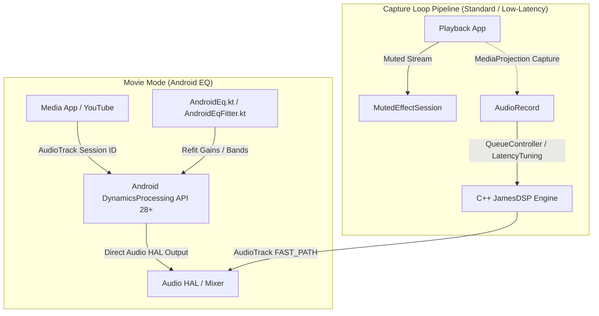

# RootlessJamesDSP Audio Processing Modes & System Architecture

This document describes the technical architecture, latency optimization mechanisms, and operational modes implemented in RootlessJamesDSP.

---

## 📑 Executive Summary & Mode Matrix

RootlessJamesDSP operates in three distinct processing modes to balance DSP capability, latency, and system stability across various media consumption scenarios.

| Mode | Technology Stack | Latency | Active DSP Capabilities | Primary Use Case |
| :--- | :--- | :--- | :--- | :--- |
| **Movie Mode** (*«Кино: Только EQ, идеальная синхронизация»*) | Direct `DynamicsProcessing` (Session 0 / App Session ID) without `capture loop` | ~10–40 ms (Block delay only) | GraphicEQ / PEQ (`preEq`, `mbc`, `postEq`) | YouTube, Netflix, TikTok (A/V sync critical) |
| **Standard Mode** (*«Стандартный»*) | Legacy `MediaProjection` Capture Loop (`AudioRecord` → C++ JamesDSP → `AudioTrack`) | ~150–170 ms | Full JamesDSP Engine (Reverb, Bass Boost, Convolver, Limiter) | Background music, podcasts, low-spec devices |
| **Low-Latency Mode** (*«Игры и Стриминг»*) | Optimized Capture Loop (`readFrames`=960, `PERFORMANCE_MODE_LOW_LATENCY`, `QueueController`) | ~20–80 ms | Full JamesDSP Engine (Reverb, Bass Boost, Convolver, Limiter) | Mobile Gaming (PUBG, CoD), live streaming, video on flagship devices |

---

## 🎬 1. Movie Mode (Android EQ Mode)

### Technical Implementation
* **Bypassing the Capture Pipeline:** When Movie Mode is enabled, `startRecording()` completely halts the rootless capture loop (`AudioRecord` / `AudioTrack`). Instead, audio session IDs are polled via `sessionManager.pollOnce()`.
* **System Effect Hook:** The application attaches an AOSP `DynamicsProcessing` (API 28+) instance directly to each media playback session.
* **Stage Distribution (`AndroidEq.kt` & `AndroidEqFitter.kt`):**
  * `preEq`: Up to 128 bands for initial frequency shaping.
  * `mbc` (Multiband Compressor): Configured as a static gain stage (`ratio=1`, `attack=3ms`, `release=80ms`).
  * `postEq`: Secondary gain stage for fine curve tuning.
  * `limiter`: Optional brickwall limiter to prevent clipping from EQ boosts.
* **Frame Alignment:** `preferredFrameDuration` is specified as `(blockSize - 0.5) * 1000 / sampleRate` to force the system HAL to align frames strictly to the requested block size (default 1024 samples).

### System Limitations & Edge Cases
* **DSP Scope:** Reverb, convolution, spatial width, and dynamic bass boost are **inactive** because audio does not pass through the C++ JamesDSP engine.
* **Android 15 AIDL Bug:** Devices running Android 15 with AIDL audio effect implementations (e.g., Pixel 8 and Pixel 9 series following the March 2025 security patch) cap the effective band count to **32 bands**. Higher band counts (>32) are silently ignored or clamped by the DSP hardware. The code automatically detects Android 15 (`SdkCheck.isVanillaIceCream`) and limits `maxBands` to 32 on such devices.
* **Recovery Mechanism:** A `setEnableStatusListener` keeps the effect active if OEM power management attempts to unload the effect.

---

## ⚖️ 2. Standard Mode (Legacy Capture Loop)

### Technical Implementation
* **Signal Flow:** `MediaProjection` audio projection captures device audio via `AudioRecord` → passes raw PCM to C++ JamesDSP engine → outputs via `AudioTrack`.
* **Muting Original Streams:** An `AudioEffect` (`MutedEffectSession`) mutes the original app playback stream to prevent duplicate audio output.
* **Buffer Allocation:** Uses full default buffer sizes (e.g., 8192 samples = ~170 ms at 48 kHz) to guarantee uninterrupted playback on resource-constrained hardware.

---

## 🚀 3. Low-Latency Mode

### Technical Implementation & Tuning (`LatencyTuning`)
* **Small Block Reads (`readFrames` = 960):** Audio is read in 20 ms chunks (960 samples at 48 kHz) rather than whole buffer allocations, reducing input-to-processing buffering.
* **Fast Audio Path:** `AudioTrack.setPerformanceMode(PERFORMANCE_MODE_LOW_LATENCY)` requests low-latency fast mixer thread allocation in `AudioFlinger`.
* **High Priority Threading:** Recorder threads run with `THREAD_PRIORITY_URGENT_AUDIO`.
* **Dynamic Latency Recovery (`QueueController`):**
  * Tracks `framesWritten` vs. `track.playbackHeadPosition`.
  * If output queue size exceeds `maxQueueFrames` (2880 samples = 60 ms), `QueueController` executes a 2 ms `fade-out`, drops excess frames while maintaining DSP internal state continuity, and executes a 2 ms `fade-in`.

---

## 📊 System Architecture Diagram

